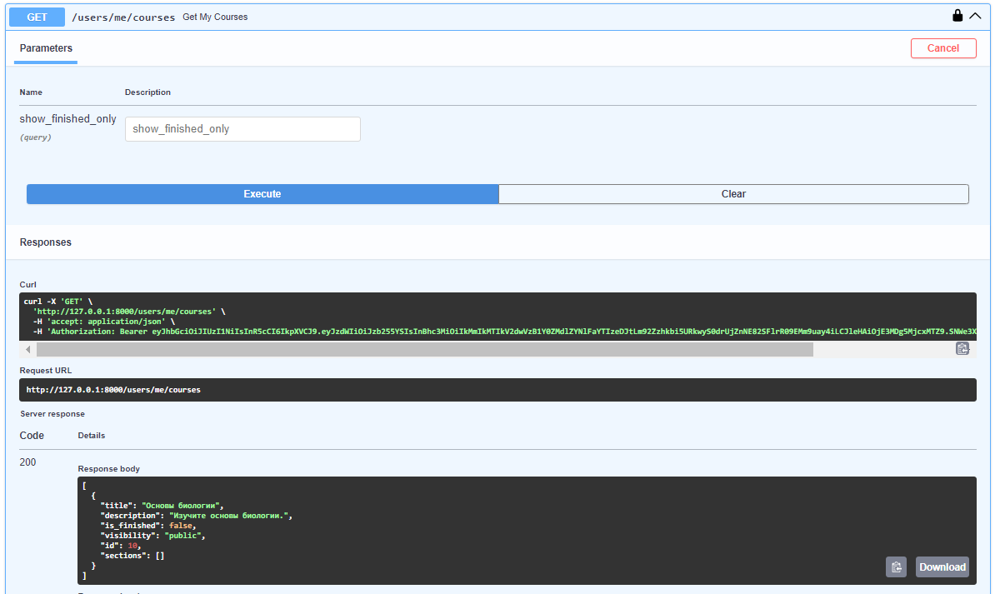
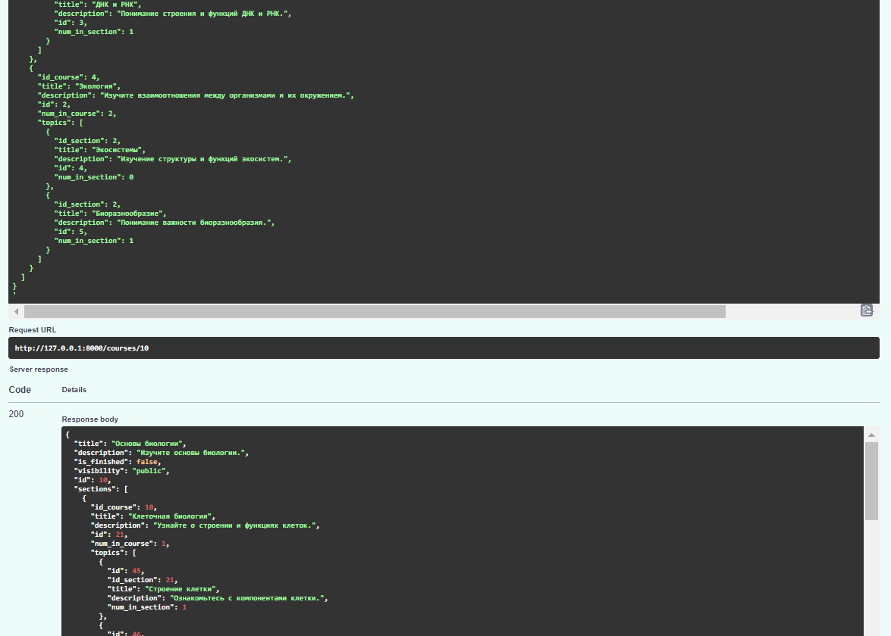
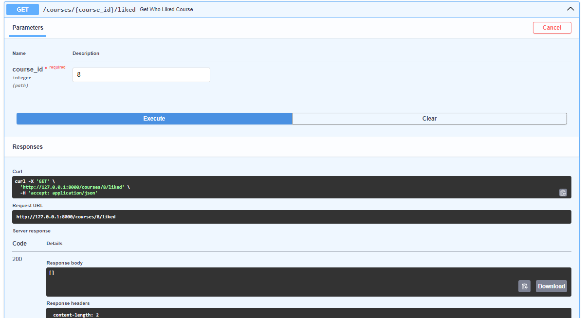

**Структура проекта**


Стэк: FastAPI, SQLModel, Postgres. Для работы с миграциями используется alembic.

**pgvector**

По условию лабораборной работы требовалось работать с СУБД Postgres, а требования к проекту содержали в себе пункт про необходимость хранения векторов (числовой репрезентации текста).
Postgres имеет расширение pgvector, и при выполнении задания было изучено, как с ним работать. Однако необходимо отметить, что на текущий момент не было принято решение, каким именно образом будет осуществляться расчет векторов, поэтому функционал пока не используется.

Для того, чтобы использовать pgvector, необходимо выполнить следующие шаги:

* скачать расширение [с GitHub](https://github.com/pgvector/pgvector?tab=readme-ov-file#installation)

* выполнить команду `CREATE EXTENSION IF NOT EXISTS vector` на уровне БД

* использовать векторы следующим образом:
```python
from sqlmodel import SQLModel, Field, Relationship
from pgvector.sqlalchemy import Vector
from sqlalchemy import Column

class SomeModel(SQLModel):
    vector: list[float] = Field(sa_column=Column(Vector(VECTOR_SIZE)))
```
**Endpoints**

Список всех реализованных эндпоинтов. Далее в отчете приводится их более подробное описание.


Пользователь. Модели.
```python
class UserBaseDisplay(SQLModel):
    full_name: str
    email: Optional[str]
    bio: Optional[str]


class UserBase(UserBaseDisplay):
    username: str


class UserCreate(UserBase):
    password: str


class UserWithPasswordBase(UserBase):
    hashed_password: str


class UserPasswordUpdate(SQLModel):
    old_password: str
    new_password: str


class Token(SQLModel):
    access_token: str
    token_type: str

    
class UserWithPK(UserWithPasswordBase):
    id: int = Field(default=None, primary_key=True)
    disabled: bool = False
    date_joined: Optional[datetime.datetime] = None


class User(UserWithPK, table=True):
    courses: List["Course"] = Relationship(back_populates="creator")
    favorite_courses: List["Course"] = Relationship(
        back_populates="liked_by", sa_relationship_kwargs={"cascade": "all, delete"}, link_model=Favourite
    )
```
Пользователь. Функционал по регистрации, авторизации, созданию JWT-токенов и т.п.
```python
oauth2_scheme = OAuth2PasswordBearer(tokenUrl="token")


def verify_password(plain_password: str, hashed_password: str) -> bool:
    return bcrypt.checkpw(plain_password.encode(), hashed_password.encode())


def get_password_hash(password: str) -> str:
    return bcrypt.hashpw(password.encode(), b'$2b$12$WgpW0ucFLvVX6QZa23x2m.').decode()  # hardcoded salt


def get_user(session: Session, username: str, hashed_password: str):
    return session.exec(select(User).where(User.username == username,
                                           User.hashed_password == hashed_password)).first()


def authenticate_user(session: Session, username: str, password: str):
    user = get_user(session, username, get_password_hash(password))
    return user


def create_access_token(data: dict, expires_delta: Optional[datetime.timedelta] = None):
    to_encode = data.copy()
    if expires_delta:
        expire = datetime.datetime.utcnow() + expires_delta
    else:
        expire = datetime.datetime.utcnow() + datetime.timedelta(minutes=ACCESS_TOKEN_EXPIRE_MINUTES)
    to_encode.update({"exp": expire})
    encoded_jwt = jwt.encode(to_encode, SECRET_KEY, algorithm=ALGORITHM)
    return encoded_jwt


def get_current_user(token: str = Depends(oauth2_scheme), session: Session = Depends(get_session)):
    credentials_exception = HTTPException(
        status_code=status.HTTP_401_UNAUTHORIZED,
        detail="Could not validate credentials",
        headers={"WWW-Authenticate": "Bearer"},
    )
    try:
        payload = jwt.decode(token, SECRET_KEY, algorithms=[ALGORITHM])
        username: str = payload.get("sub")
        password: str = payload.get("pass")
        if username is None or password is None:
            raise credentials_exception
        user = get_user(session, username, password)
        if user is None:
            raise credentials_exception
        return user
    except jwt.PyJWTError:
        raise credentials_exception


def get_current_active_user(current_user: User = Depends(get_current_user)):
    if current_user.disabled:
        raise HTTPException(status_code=400, detail="Inactive user")
    return current_user
```
Пользователь. Эндпоинты.
```python
@app.post("/token", response_model=Token)
def login_for_access_token(
        form_data: OAuth2PasswordRequestForm = Depends(), session: Session = Depends(get_session)
):
    user = authenticate_user(session, form_data.username, form_data.password)
    if not user:
        raise HTTPException(
            status_code=status.HTTP_401_UNAUTHORIZED,
            detail="Incorrect username or password",
            headers={"WWW-Authenticate": "Bearer"},
        )
    access_token_expires = datetime.timedelta(minutes=ACCESS_TOKEN_EXPIRE_MINUTES)
    access_token = create_access_token(
        data={"sub": user.username, "pass": user.hashed_password}, expires_delta=access_token_expires
    )
    return {"access_token": access_token, "token_type": "bearer"}


@app.get("/users", response_model=List[UserWithPK])
def list_users(
        show_disabled: Optional[bool] = None,
        session: Session = Depends(get_session)
):
    if show_disabled is None:
        return session.exec(select(User)).all()
    return session.exec(select(User).where(User.disabled == show_disabled)).all()


@app.post("/register", response_model=UserBase)
def register_user(user: UserCreate, session: Session = Depends(get_session)):
    if authenticate_user(session, user.username, user.password):
        raise HTTPException(
            status_code=status.HTTP_400_BAD_REQUEST,
            detail="Username already registered"
        )
    data = user.__dict__
    data.update({'hashed_password': get_password_hash(user.password),
                 'date_joined': datetime.datetime.now()})
    new_user = User(**data)
    session.add(new_user)
    session.commit()
    session.refresh(new_user)
    return data


@app.get("/users/me", response_model=UserWithPK)
def read_users_me(
        current_user: User = Depends(get_current_active_user)
):
    return current_user


@app.get("/users/{user_id}", response_model=UserWithPK)  # returns user even if they are disabled
def get_user_by_id(user_id: int, session: Session = Depends(get_session)) -> User:
    return session.exec(select(User).where(User.id == user_id)).first()


@app.put("/users/me/password")
def change_password(
        password_update: UserPasswordUpdate,
        current_user: User = Depends(get_current_active_user),
        session: Session = Depends(get_session)
):
    user = session.exec(select(User).where(User.id == current_user.id)).first()
    if not user or not verify_password(password_update.old_password, user.hashed_password):
        raise HTTPException(
            status_code=status.HTTP_401_UNAUTHORIZED,
            detail="Old password is incorrect"
        )
    user.hashed_password = get_password_hash(password_update.new_password)
    session.commit()
    return {"msg": "Password updated successfully"}


@app.patch("/users/me/disable")
def disable_user(
        current_user: User = Depends(get_current_active_user),
        session: Session = Depends(get_session)
):
    current_user.disabled = True
    session.commit()
    return {"msg": f"User {current_user.username} disabled"}
```
Пользователь. Примеры.

_Регистрация. В базе хранятся только захэшированные пароли._


_Авторизация_


_Все пользователи_


_Текущий пользователь_


Также присутствует функционал по "удалению" пользователя (set disable=True), но данное действие необратимо. И доступна опция изменения пароля, которая потребует выйти и перезайти в аккаунт после выполнения.

Курсы. Модели.
```python
class CourseBase(SQLModel):
    title: str
    description: Optional[str] = None
    is_finished: bool = False
    visibility: VisibilityEnum = VisibilityEnum.public


class SectionBase(SQLModel):
    id_course: Optional[int] = Field(default=None, foreign_key="course.id")
    title: str
    description: Optional[str] = None


class TopicBase(SQLModel):
    id_section: Optional[int] = Field(default=None, foreign_key="section.id")
    title: str
    description: Optional[str] = None


class CourseWithPK(CourseBase):
    id: int = Field(default=None, primary_key=True)


class CourseWithPKExt(CourseWithPK):
    date_created: Optional[datetime.datetime] = None
    # vector: List[float] = Field(sa_column=Column(Vector(VECTOR_SIZE)))  TODO: add vector similarity search


class SectionWithPK(SectionBase):
    id: int = Field(default=None, primary_key=True)
    num_in_course: int


class TopicWithPK(TopicBase):
    id: int = Field(default=None, primary_key=True)
    num_in_section: int


class Course(CourseWithPKExt, table=True):
    id_creator: Optional[int] = Field(default=None, foreign_key="user.id")
    creator: "User" = Relationship(back_populates="courses")
    liked_by: List["User"] = Relationship(back_populates="favorite_courses", link_model=Favourite)
    sections: List["Section"] = Relationship(back_populates="course", sa_relationship_kwargs={"cascade": "all, delete"})


class Section(SectionWithPK, table=True):
    course: "Course" = Relationship(back_populates="sections")
    topics: List["Topic"] = Relationship(back_populates="section", sa_relationship_kwargs={"cascade": "all, delete"})


class Topic(TopicWithPK, table=True):
    section: "Section" = Relationship(back_populates="topics")


class SectionDisplay(SectionWithPK):
    topics: List[Topic]  # to preserve nested view


class CourseDisplay(CourseWithPK):
    sections: List[SectionDisplay]  # to preserve nested view


class CourseDisplayWithCreator(CourseDisplay):
    creator: UserBaseDisplay


class CourseDisplayWithCreatorAndComment(CourseDisplayWithCreator):
    comment: str
```

Курсы. Эндпоинты.
```python
@app.get("/courses/public")
def get_public_courses(show_finished_only: Optional[bool] = None,
                       session: Session = Depends(get_session)) -> List[CourseDisplayWithCreator]:
    if show_finished_only is None:
        return session.exec(select(Course).where(Course.visibility == VisibilityEnum.public)).all()
    return session.exec(select(Course).where(Course.visibility == VisibilityEnum.public,
                                             Course.is_finished == show_finished_only)).all()


@app.get("/courses/{course_id}",
         response_model=CourseDisplayWithCreator)  # you can get either your courses or public ones
def get_course_by_id(course_id: int, current_user: User = Depends(get_current_active_user),
                     session: Session = Depends(get_session)):
    course = session.exec(select(Course).where(Course.id == course_id)).first()
    if not course:
        raise HTTPException(status_code=404, detail="Course not found")
    if course.visibility == VisibilityEnum.public or course.creator == current_user:
        return course


@app.get("/users/me/courses", response_model=List[CourseDisplay])  # can see all my courses, including private ones
def get_my_courses(show_finished_only: Optional[bool] = None,
                   current_user: User = Depends(get_current_active_user), session: Session = Depends(get_session)):
    if show_finished_only is None:
        return session.exec(select(Course).where(Course.id_creator == current_user.id)).all()
    return session.exec(select(Course).where(Course.id_creator == current_user.id,
                                             Course.is_finished == show_finished_only)).all()


@app.get("/users/{user_id}/courses", response_model=List[CourseDisplay])  # can only see public ones
def get_user_courses(user_id: int, show_finished_only: Optional[bool] = None, session: Session = Depends(get_session)):
    if show_finished_only is None:
        return session.exec(
            select(Course).where(Course.id_creator == user_id, Course.visibility == VisibilityEnum.public)).all()
    return session.exec(select(Course).where(Course.id_creator == user_id, Course.visibility == VisibilityEnum.public,
                                             Course.is_finished == show_finished_only)).all()


@app.post("/courses/", response_model=CourseDisplayWithCreator)
def add_course(course: CourseBase, current_user: User = Depends(get_current_active_user),
               session: Session = Depends(get_session)):
    data = course.__dict__
    data.update({'id_creator': current_user.id, 'date_created': datetime.datetime.now()})
    new_course = Course(**data)
    session.add(new_course)
    session.commit()
    return new_course


@app.delete("/courses/")
def delete_course(course_id: int, current_user: User = Depends(get_current_active_user),
                  session: Session = Depends(get_session)):
    course = session.exec(
        select(Course).where(Course.id == course_id, Course.id_creator == current_user.id)).first()
    if not course:
        raise HTTPException(status_code=404, detail="Course not found")
    else:
        session.delete(course)
        session.commit()
    return {"ok": True}
```

Курсы. Эндпоинт для работы со всей структурой курса в рамках одного JSON-а.
```python
@app.patch("/courses/{course_id}",
           response_model=CourseDisplay)  # the reason for the following complicated logic is drag&drop on the frontend side
def update_course(course_id: int, course_update: CourseDisplay,
                  current_user: User = Depends(get_current_active_user), session: Session = Depends(get_session)):
    # retrieve the existing course from the database
    existing_course = session.exec(
        select(Course).where(Course.id == course_id, Course.id_creator == current_user.id)).first()
    if not existing_course:
        raise HTTPException(status_code=status.HTTP_404_NOT_FOUND, detail="Course not found")

    # begin a transaction
    with session.begin_nested():
        # update the course fields
        if course_update.title:
            existing_course.title = course_update.title
        if course_update.description:
            existing_course.description = course_update.description
        if course_update.is_finished:
            existing_course.is_finished = course_update.is_finished
        if course_update.visibility:
            existing_course.visibility = course_update.visibility

        # update sections and topics
        update_sections_and_topics(existing_course, course_update.sections, session)
        # commit the changes
        session.commit()
    # return the updated course
    return existing_course


def update_sections_and_topics(existing_course, sections_data, session):
    # maps to keep track of existing sections and topics by ID
    existing_sections_map = OrderedDict([(section.id, section) for section in existing_course.sections])
    existing_topics_map = OrderedDict()
    for section in existing_course.sections:
        for topic in section.topics:
            existing_topics_map[topic.id] = topic

    # process the sections data
    for i, section_data in enumerate(sections_data):
        if section_data.id in existing_sections_map:
            # update the existing section
            existing_section = existing_sections_map[section_data.id]
            existing_section.num_in_course = i + 1
            if section_data.title:
                existing_section.title = section_data.title
            if section_data.description:
                existing_section.description = section_data.description
            # update the topics for this section
            update_topics(existing_section, section_data.topics, session)
        else:
            # create a new section
            new_section = Section(id_course=existing_course.id, title=section_data.title,
                                  description=section_data.description, num_in_course=i + 1)
            session.add(new_section)
            session.flush()  # to get the new section ID
            if section_data.topics:
                update_topics(new_section, section_data.topics, session)

    # delete sections that were not in the update
    for existing_section_id, existing_section in existing_sections_map.items():
        if all(section_data.id != existing_section_id for section_data in sections_data):
            session.delete(existing_section)


def update_topics(existing_section, topics_data, session):
    # maps to keep track of existing topics by ID
    existing_topics_map = OrderedDict([(topic.id, topic) for topic in existing_section.topics])

    # process the topics data
    for i, topic_data in enumerate(topics_data):
        if topic_data.id in existing_topics_map:
            # update the existing topic
            existing_topic = existing_topics_map[topic_data.id]
            if topic_data.title:
                existing_topic.title = topic_data.title
            if topic_data.description:
                existing_topic.description = topic_data.description
            existing_topic.num_in_section = i + 1
        else:
            # create a new topic
            new_topic = Topic(id_section=existing_section.id, title=topic_data.title,
                              description=topic_data.description, num_in_section=i + 1)
            session.add(new_topic)

    # delete topics that were not in the update
    for existing_topic_id, existing_topic in existing_topics_map.items():
        if all(topic_data.id != existing_topic_id for topic_data in topics_data):
            session.delete(existing_topic)
```
Курсы. Примеры.

_Все курсы_


_Один курс_


Следующий курс существует, но он private.


_Создание курса_


_Курсы текущего пользователя_



_Редактирование курса_




_Удаление курса_


Если нажать ещё раз:


Избранное. Модели.
```python
class FavouriteBase(SQLModel):
    id_course: Optional[int] = Field(default=None, foreign_key="course.id")
    comment: Optional[str] = None


class FavouriteWithPK(FavouriteBase):
    id: int = Field(default=None, primary_key=True)
    date_added: Optional[datetime.datetime] = None


class Favourite(FavouriteWithPK, table=True):
    id_user: Optional[int] = Field(default=None, foreign_key="user.id")
```
Избранное. Эндпоинты.
```python
@app.get("/courses/{course_id}/liked", response_model=List[UserBase])
def get_who_liked_course(course_id: int, session: Session = Depends(get_session)):
    course = get_course_by_id(course_id, session=session)
    if course:
        return course.liked_by
    return []


@app.get("/users/me/favourites", response_model=List[CourseDisplayWithCreatorAndComment])  # it's ugly but it works
def get_my_favourites(current_user: User = Depends(get_current_active_user), session: Session = Depends(get_session)):
    outcome = []
    for course in current_user.favorite_courses:
        data = course.__dict__
        data.update({'comment': session.exec(select(Favourite).where(Favourite.id_user == current_user.id,
                                                                     Favourite.id_course == course.id)).first().comment,
                    'sections': course.sections, 'creator': course.creator})
        outcome.append(data)
    return outcome


@app.post("/favourites/")
def add_favourite(favourite: FavouriteBase, course_id: int, current_user: User = Depends(get_current_active_user),
                  session: Session = Depends(get_session)):
    course = get_course_by_id(course_id, current_user, session)  # you cannot add private as favs
    if course:
        already_exists = session.exec(select(Favourite).where(Favourite.id_user == current_user.id,
                                                              Favourite.id_course == course_id)).first()  # or if its already there
        if not already_exists:
            data = favourite.__dict__
            data.update({'id_user': current_user.id, 'id_course': course_id, 'date_added': datetime.datetime.now()})
            new_favourite = Favourite(**data)
            session.add(new_favourite)
            session.commit()
            return {"ok": True}
        return {'msg': 'Favourite already exists!'}
    raise HTTPException(status_code=404, detail="Course not found")


@app.delete("/favourites/")
def delete_favourite(course_id: int, current_user: User = Depends(get_current_active_user),
                     session: Session = Depends(get_session)):
    favourite = session.exec(select(Favourite).where(Favourite.id_user == current_user.id,
                                                     Favourite.id_course == course_id)).first()
    if favourite:
        session.delete(favourite)
        session.commit()
    return {"ok": True}
```
Избранное. Примеры.

_Добавление в избранное_


_Избранное текущего пользователя_


_Пользователи, которым понравился какой-либо курс_


_Удаление из избранного_



