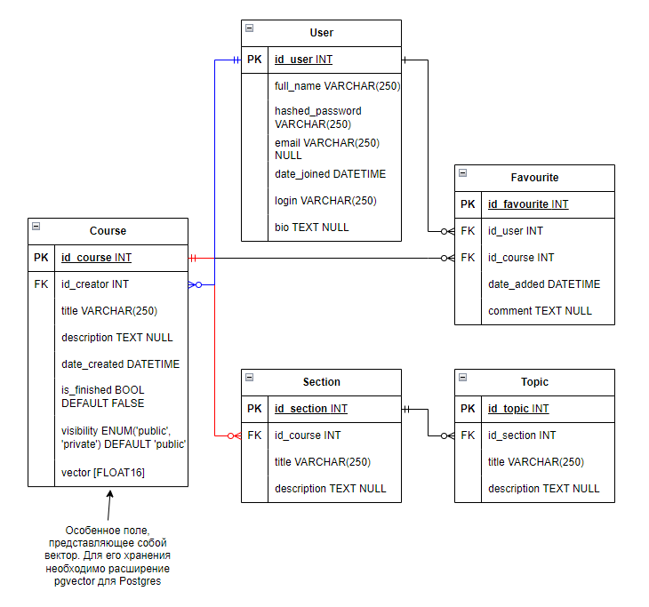

**Задание**

Выполнить практики 2.1-2.3. Их можно реализовать на примере, приведенном в текстах практик или используя выбранную тему. Практики можно предоставить в любом из ниже приведенных вариантов:

* Каждая практика - отдельная папка в репозитории.

* Каждая практика - отдельная ветка в репозитории.

* Каждая практика - отдельный коммит в репозитории.

**Задание на 9 Баллов:** 

Реализовать на основании выбранной модели с помощью инструкций из практик серверное приложение на FastAPI. Оно должно включать в себя:

* Таблицы, реализованные с помощью ORM SQLAlchemy или SQLModel с использованием БД PostgreSQL.

* API, содержащее CRUD-ы. Там где это необходимо, реализовать GET-запросы возвращающие модели с вложенными объектами (связи many-to-many и one-to-many).

* Настроенную систему миграций с помощью библиотеки Alembic.

* Аннотацию типов в передаваемых и возвращаемых значениях в API-методах.

* Оформленную файловую структуру проекта с разделением кода, отвечающего за разную бизнес-логику и предметную область, на отдельные файлы и папки.

* (опционально) Комментарии к сложным частям кода.

**Задание на 15 Баллов (можно реализовывать сразу):** 

Необходимо реализовать функционал пользователя в разрабатываемом приложении. Функционал включает в себя:

* Авторизацию и регистрацию

* Генерацию JWT-токенов

* Аутентификацию по JWT-токену

* Хэширование паролей

* Дополнительные АПИ-методы для получения информации о пользователе, списка пользователей и смене пароля

**Комментарий:**

При выполнении лабораторной работы был выбран вариант на 15 баллов с реализацией "сразу". В качестве варианта была выбрана своя база данных, практические задания выполнялись на её основе. В отчете приводится только финальная версия кода с текстовым пояснением. 

Схема реализуемой базы данных выглядит следующим образом:

Сама база данных предназначена для сервиса, позволяющего генерировать тематические структуры курсов. В перспективе предполагается добавление LLM (большой языковой модели) и векторного поиска наиболее схожих между собой курсов для реализации RAG (Retrieval Augmented Generation). 

Говоря о необходимом функционале для MVP-реализации:

* есть пользователи, они могут регистрироваться в системе и создавать курсы. Для просмотра курсов регистрация не требуется

* курсы состоят из разделов, разделы состоят из тем. Предполагается реализация drag&drop функционала на фронте (прототип уже существует), поэтому изменение составных частей курса должно происходить в рамках общего JSON-представления курса

* у пользователей есть избранное, куда можно добавлять понравившиеся курсы коллег

* существует возможность хранить в базе векторное представление курса
