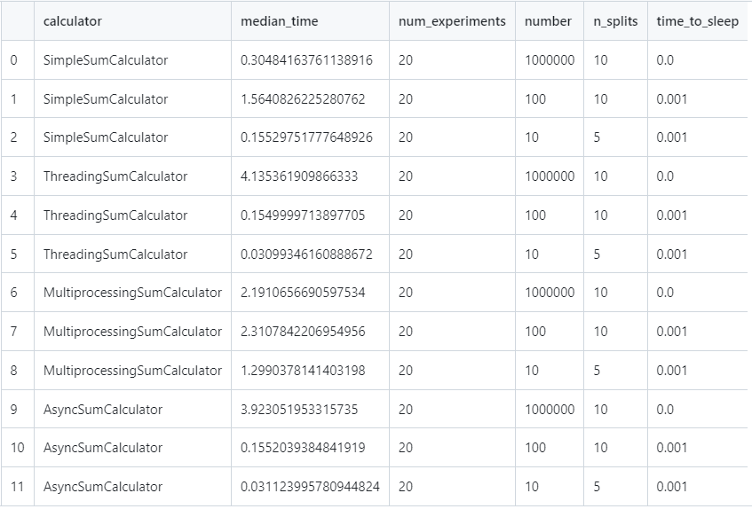

## Различия между threading, multiprocessing и async в Python

### Задание

Напишите три различных программы на Python, использующие каждый из подходов: threading, multiprocessing и async.  
Каждая программа должна решать считать сумму всех чисел от 1 до 1000000.  
Разделите вычисления на несколько параллельных задач для ускорения выполнения.

### Решение

Так как вычисление суммы чисел является CPU-bound задачей (а для таких задач бессмысленно, например, использовать асинхронность), немного изменим формулировку задания. Будем вычислять сумму в цикле while и делать задержку после каждой итерации, имитируя дополнительную нагрузку. Также будем разбивать заданный числовой диапазон на n частей для проведения вычислений. 

Базовый класс выглядит следующим образом:

```python
class BaseSumCalculator(ABC):
    def __init__(self, number: int = 1_000_000, n_splits: int = 10, time_to_sleep: float = 0.001) -> None:
        self.number: int = number
        self.n_splits: int = n_splits
        self.time_to_sleep: float = time_to_sleep
        self.tasks: List[Tuple[int, int]] = self.split_task()

    def split_task(self) -> List[Tuple[int, int]]:
        """
        >>> try:
        ...     BaseSumCalculator(7, 10).split_task()
        ... except AssertionError:
        ...     print("AssertionError raised")
        AssertionError raised
        >>> BaseSumCalculator(6, 2).split_task()
        [(1, 3), (4, 6)]
        >>> BaseSumCalculator(6, 1).split_task()
        [(1, 6)]
        >>> BaseSumCalculator(10, 3).split_task()
        [(1, 3), (4, 6), (7, 10)]
        >>> BaseSumCalculator(11, 3).split_task()
        [(1, 3), (4, 6), (7, 11)]
        >>> BaseSumCalculator(100, 5).split_task()
        [(1, 20), (21, 40), (41, 60), (61, 80), (81, 100)]
        """
        if self.n_splits > self.number:
            raise AssertionError("Number of splits cannot exceed the number itself.")
        chunk_size = self.number // self.n_splits
        tasks = []
        start = 1
        for _ in range(self.n_splits):
            end: int = start + chunk_size - 1 if start + chunk_size - 1 <= self.number - chunk_size else self.number
            tasks.append((start, end))
            start += chunk_size
        return tasks

    async def calculate_sum(self) -> int:
        total_sum = 0
        for start, end in self.tasks:
            total_sum += await self.calculate_range_sum(start, end)
        return total_sum

    def run_one_experiment(self, is_async: bool = False) -> Tuple[int, float]:
        start_time = time.time()
        calculated_sum = asyncio.run(self.calculate_sum()) if is_async else self.calculate_sum()
        end_time = time.time()
        execution_time = end_time - start_time
        return calculated_sum, execution_time

    def run_experiments(self, num_iterations: int = 20, is_async: bool = False, verbose = True) -> float:
        times = []

        for _ in tqdm(range(num_iterations)):
            _, execution_time = self.run_one_experiment(is_async=is_async)
            times.append(execution_time)

        median_time = statistics.median(times)
        if verbose:
            print("Median time:", median_time) 
        return median_time


class AbstractBaseSumCalculator(BaseSumCalculator):
    @abstractmethod
    def __str__(self) -> str:
        pass
    
    @abstractmethod
    def calculate_range_sum(self, start: int, end: int) -> int:
        pass

    @abstractmethod
    def calculate_sum(self) -> int:
        pass
```

Конкретные реализации:

=== "sync"

    ```python
    class SimpleSumCalculator(AbstractBaseSumCalculator):
    def __str__(self):
        return "SimpleSumCalculator"
    
    def calculate_range_sum(self, start_end):
        start, end = start_end
        total_sum = 0
        current_number = start
        while current_number <= end:
            total_sum += current_number
            current_number += 1
            time.sleep(self.time_to_sleep)
        return total_sum
    
    def calculate_sum(self):
        results = [self.calculate_range_sum(task) for task in self.tasks]
        total_sum = sum(results)
        return total_sum
    ```

    Все числа просто суммируются.

=== "threading"

    ```python
    class ThreadingSumCalculator(AbstractBaseSumCalculator):
    def __str__(self):
        return "ThreadingSumCalculator"
    
    def calculate_range_sum(self, start_end):
        start, end = start_end
        total_sum = 0
        current_number = start
        while current_number <= end:
            total_sum += current_number
            current_number += 1
            time.sleep(self.time_to_sleep)
        return total_sum

    def calculate_sum(self):
        results = []

        def worker(task):
            partial_sum = self.calculate_range_sum(task)
            results.append(partial_sum)

        threads = []

        for task in self.tasks:
            thread = threading.Thread(target=worker, args=(task,))
            threads.append(thread)
            thread.start()

        for thread in threads:
            thread.join()

        total_sum = sum(results)
        return total_sum
    ```

    Для вычисления каждого кусочка от общей суммы создается отдельный поток. По завершении все промежуточные результаты суммируются.

=== "multiprocessing"

    ```python
    class MultiprocessingSumCalculator(AbstractBaseSumCalculator):
    def __str__(self):
        return "MultiprocessingSumCalculator"
    
    def calculate_range_sum(self, start_end):
        start, end = start_end
        total_sum = 0
        current_number = start
        while current_number <= end:
            total_sum += current_number
            current_number += 1
            time.sleep(self.time_to_sleep)
        return total_sum
    
    def calculate_sum(self):
        pool = multiprocessing.Pool(processes=self.n_splits)
        results = pool.map(self.calculate_range_sum, self.tasks)
        pool.close()
        pool.join()
        total_sum = sum(results)
        return total_sum
    ```

    Для вычисления каждого кусочка от общей суммы создается отдельный процесс. По завершении все промежуточные результаты суммируются.

=== "async"

    ```python
    class AsyncSumCalculator(AbstractBaseSumCalculator):
    def __str__(self):
        return "AsyncSumCalculator"
    
    async def calculate_range_sum(self, start_end):
        start, end = start_end
        total_sum = 0
        current_number = start
        while current_number < end + 1:
            total_sum += current_number
            current_number += 1
            await asyncio.sleep(self.time_to_sleep)  # Allow other tasks to run
        return total_sum

    async def calculate_sum(self):
        tasks = [asyncio.create_task(self.calculate_range_sum(task)) for task in self.tasks]
        results = await asyncio.gather(*tasks)
        total_sum = sum(results)
        return total_sum
    ```

    Каждый кусочек вычисляется с использованием асинхронного подхода. По завершении все промежуточные результаты суммируются.

### Сравнение и итоги

Было проведено несколько запусков программы с разными входными параметрами экспериментов. Результаты можно видеть в таблице:



Во-первых, при вычислении CPU-bound задачи синхронная реализация работает быстрее всего. Однако кажется, что мультипроцессинг будет работать лучше, когда задачи станут более тяжеловесными. Сейчас этого не видно, так как при мультипроцессинге затрачивается время на аллоцирование вычислений на отдельные ядра, что перевешивает выгоду от использования мультипроцессинга.

Во-вторых, в I/O-bound задачах лучше всего работает асинхронность. Что не удивительно, так как именно для переключения между чего-то ждущими задачами асинхронность и предназначена. 

Интересным наблюдением является то, что threading и asyncio работают почти одинаково. Вероятно, их программаная реализация похожа.
