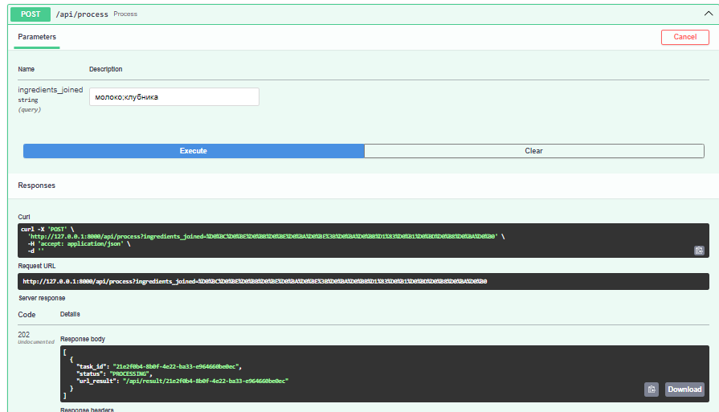
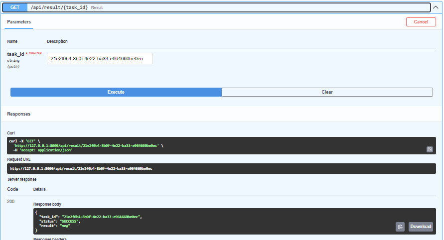

Начнем с того, зачем вообще в подобном приложении нужна очередь. 

ML-модели требовательны к ресурсам, их работа может занимать довольно много времени. Несмотря на то, что представленная в данной работе модель работает быстро, это не означает, что в дальнейшем ситуация не изменится. Запуск тяжелых вычислений через очередь позволяет не блокировать приложение (что важно в случае большого количества пользователей), а также создавать несколько инстансов модели для распределения нагрузки.

Модель обернута в отдельное FastAPI-приложение, а очередь реализована через Redis + Celery, где Redis выступает в том числе как брокер сообщений. Была попытка поднять RabbitMQ, но он, хотя поднимался локально, выкидывал странные ошибки с путями в докере, поэтому было решено пойти по пути наименьшего сопротивления. API иммет три эндпоинта, связанных с обработкой задач в фоновом режиме: создание задачи, проверка статуса, получение результата: 

```python

app = FastAPI()


@app.post('/api/predict')
async def create_prediction(ingredients_joined: str = ''):
    task = predict.delay(ingredients_joined)
    return JSONResponse(status_code=202, content={'task_id': task.id, 'status': task.status,})


@app.get('/api/result/{task_id}')
async def get_result(task_id: str):
    task = AsyncResult(task_id, app=celery_app)
    if not task.ready():
        return JSONResponse(status_code=202, content={'task_id': task_id, 'status': task.status, 'result': None})
    result = task.get()
    return JSONResponse(status_code=200, content={'task_id': task_id, 'status': task.status, 'result': result['result']})


@app.get('/api/status/{task_id}')
async def get_status(task_id: str):
    task = AsyncResult(task_id, app=celery_app)
    return JSONResponse(status_code=200, content={'task_id': task_id, 'status': task.status})

```

А вот так выглядит выполняемая задача: 

```python

class PredictTask(Task):
    def __init__(self):
        super().__init__()
        self.tokenizer = None
        self.model = None
        self.base_mask = None
        self.optional_mask = None

    def __call__(self, *args, **kwargs):
        
        if not self.tokenizer: 
            self.tokenizer = load_tokenizer('celery_tasks/models/tokenizer.pkl')
            if len(BASE_WORDS_WHITELIST):
                self.base_mask = create_prediction_mask(self.tokenizer, BASE_WORDS_WHITELIST)
            if len(OPTIONAL_WORDS_WHITELIST):
                self.optional_mask = create_prediction_mask(self.tokenizer, OPTIONAL_WORDS_WHITELIST)
                
        if not self.model:
            self.model = load_model('celery_tasks/models/model.h5')
            
        return self.run(*args, **kwargs)


@app.task(ignore_result=False, bind=True, base=PredictTask)
def predict(self, ingredients_joined: str) -> dict[str]:
    try:
        if ingredients_joined == '':  # first ingredient is always base
            prediction = predict_next_word(self.tokenizer, self.model, ingredients_joined, mask=self.base_mask)
        else:
            prediction = predict_next_word(self.tokenizer, self.model, ingredients_joined, mask=self.optional_mask)
        return {'status': 'SUCCESS', 'result': prediction}
    except Exception as ex:
        try:
            self.retry(countdown=2)
        except MaxRetriesExceededError as ex:
            return {'status': 'FAIL', 'result': 'max retried achieved'}

```

Небольшой пример работы:




Основное приложение может общаться с данным через http-запросы, а именно

``` python

app = FastAPI()
app.add_middleware(
    CORSMiddleware,
    allow_origins=origins,
    allow_credentials=True,
    allow_methods=["*"],
    allow_headers=["*"],
)

CELERY_APP_URL = "http://celery_app:5000"

...

@app.post('/api/process')
async def process(ingredients_joined: str = ''):
    async with httpx.AsyncClient() as client:
        try:
            response = await client.post(f"{CELERY_APP_URL}/api/predict?ingredients_joined={ingredients_joined}")
            response.raise_for_status()
            task_info = response.json()
            return task_info
        except httpx.HTTPStatusError as exc:
            raise HTTPException(status_code=exc.response.status_code, detail=exc.response.text)
        except Exception as ex:
            raise HTTPException(status_code=500, detail=str(ex))


@app.get('/api/result/{task_id}')
async def result(task_id: str):
    async with httpx.AsyncClient() as client:
        try:
            response = await client.get(f"{CELERY_APP_URL}/api/result/{task_id}")
            response.raise_for_status()
            task_info = response.json()
            return task_info
        except httpx.HTTPStatusError as exc:
            raise HTTPException(status_code=exc.response.status_code, detail=exc.response.text)
        except Exception as ex:
            raise HTTPException(status_code=500, detail=str(ex))


@app.get('/api/status/{task_id}')
async def status(task_id: str):
    async with httpx.AsyncClient() as client:
        try:
            response = await client.get(f"{CELERY_APP_URL}/api/status/{task_id}")
            response.raise_for_status()
            task_info = response.json()
            return task_info
        except httpx.HTTPStatusError as exc:
            raise HTTPException(status_code=exc.response.status_code, detail=exc.response.text)
        except Exception as ex:
            raise HTTPException(status_code=500, detail=str(ex))

```