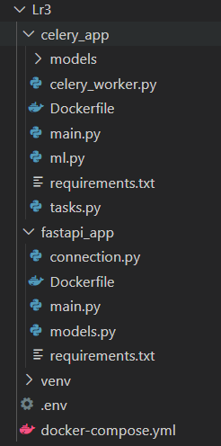

Таким образом, в рамках лабораторной работы был создан прототип веб-приложения для работы с ML-моделью. Была реализована логика обработки запросов к модели с помощью механизма очередей. Также приложение было упаковано в докер, чтобы любой желающий мог развернуть его у себя самостоятельно (P.S. лицензия не указана, но обученную модель просто так брать нельзя - придите и спросите в лс, тг sonya_leaf). 

Итоговая структура приложения выглядит следующим образом: 

Текущие ограничения приложения заключаются в ограниченности его функционала, неполноценном учете пользовательских сессий, слабой ML-модели.

В дальнейшем предполагается, что модель переедет в хранилище S3 и в неё будет добавлена логика персонализации предсказаний - под задачу дообучения под конкретных пользовтаелей будет с определенным интервалом запускаться фоновый процесс. 