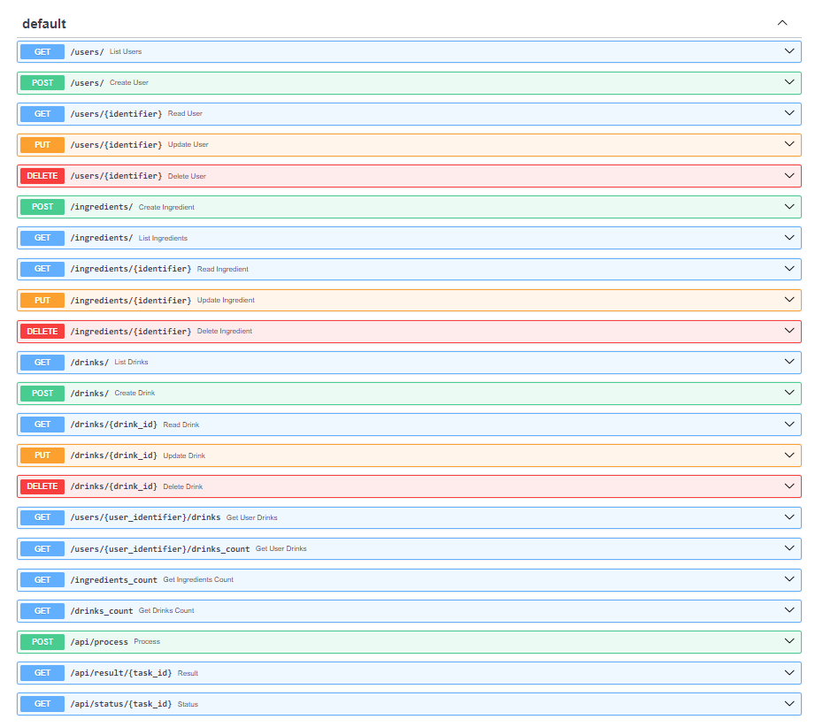

# Постановка задачи

Реализованное в данной работе приложение не связано с ЛР1, однако достаточно сильно связано с ЛР2 - можно сказать, что оно является её логическим продолжением. Однако нужно отметить, что текущее приложение не использует наработки предыдущих работ в чистом виде.

Мотивация для создания отдельного нового решения заключается в следующем: на работе потребовалось разработать прототип приложения, позволяющего работать с ML-моделью через интерфейс. Обязательным условием является хранение истории каждого пользователя.

Идея приложения следующая: с помощью него люди могут создавать свои собственные напитки из доступных ингредиентов. ML присутствует в виде рекомендательной системы, выполняющей функцию поддержки принятия решений.

В системе на текущий момент три сущности - Пользователь, Ингредиент и Напиток. Пользователь может создавать и оценивать Напитки, каждый Напиток состоит из Ингредиентов (ровно один Базовый и 0-3 Дополнительных). Ингредиент в Напитке имеет "степень выраженности вкуса", определяемую как число от 1 до 5. Код для создания базы данных выглядит следующим образом:

```python
class IngredientType(str, Enum):
    base = "base"
    additive = "additive"


class IngredientDrinkLink(SQLModel, table=True):
    drink_id: Optional[int] = Field(default=None, foreign_key="drink.id", primary_key=True)
    ingredient_id: Optional[int] = Field(default=None, foreign_key="ingredient.id", primary_key=True)
    amount: int = Field(default=1, ge=1, le=5)
    n_in_drink: int


class Ingredient(SQLModel, table=True):
    id: Optional[int] = Field(default=None, primary_key=True)
    name: str = Field(sa_column_kwargs={"unique": True}, index=True)
    type: IngredientType
    
    drinks: List["Drink"] = Relationship(
        back_populates="ingredients", link_model=IngredientDrinkLink
    )


class User(SQLModel, table=True):
    id: Optional[int] = Field(default=None, primary_key=True)
    login: str = Field(sa_column_kwargs={"unique": True}, index=True)
    
    drinks: List["Drink"] = Relationship(back_populates="user")


class Drink(SQLModel, table=True):
    id: Optional[int] = Field(default=None, primary_key=True)
    user_id: int = Field(foreign_key="user.id")
    date_created: datetime = Field(default_factory=datetime.now)
    ice: bool = Field(default=False)
    rating: Optional[int] = Field(default=None, ge=1, le=5)
    
    user: User = Relationship(back_populates="drinks")
    ingredients: List["Ingredient"] = Relationship(
        back_populates="drinks", link_model=IngredientDrinkLink
    )

    @root_validator(pre=True)
    def validate_ingredients(cls, values):
        ingredients = values.get('ingredients', [])
        base_count = sum(1 for ingredient in ingredients if ingredient.type == IngredientType.base)
        additive_count = sum(1 for ingredient in ingredients if ingredient.type == IngredientType.additive)

        if base_count != 1:
            raise ValueError('A drink must have exactly one base ingredient.')
        if not (0 <= additive_count <= 3):
            raise ValueError('A drink must have between 0 and 3 additive ingredients.')

        return values
```

Может возникнуть вопрос, почему у Пользователя нет пароля. Причина в том, чтобы не перегружать интерфейс - гораздо проще передать логин в качестве параметра, нежели перезаходить под другим логином и паролем. Повторюсь, что цель приложения - предоставить интерфейс для работы с ML-моделью. 

# API

Немного про API. Типовые эндпоинты на всё (последние три - для обращения по http ко второму приложению через Celery, об этом чуть позже). Из интересного - Пользователь и Ингредиент могут передаваться как по id, так и по названию (человеку легче воспринимать названия), на эти поля стоит ограничение уникальности. Ещё из интересного - у Напитка можно изменять только рейтинг, причем сделать это может только создатель Напитка.



# ML-модель

Логика работы модели следующая - на вход подается последовательность ингредиентов (на текущий момент - в виде текста через точку с запятой и без пробелов вокруг знака препинания), но выход возвращается ингредиент-предсказание также в текстовом виде. Использование текста, а не объектов, продиктовано особенностью модели - она представляет собой LSTM, учившуюся на текстовых токенах. Кроме того, благодаря подобному подходу не создается зависимость ML-модели от спецификаций приложения-интерфейса. Учитывая, что ML-модель является самой динамичной и изменяемой частью системы, это необходимо. Пайплайн работы модели выглдяит следующим образом: 

```python

tokenizer = load_tokenizer('./models/tokenizer.pkl')
model = load_model('./models/model.h5')
prediction = predict_next_word(tokenizer, model, "молоко", mask=None)

```

С помощью максим задается набор доступных Базовых и Добавочных Ингредиентов.

Текущая представленная модель обучалась на данных сайта Поваренок.ру с использвоанием вычислительных мощностей Google Colab и фреймворка Keras.